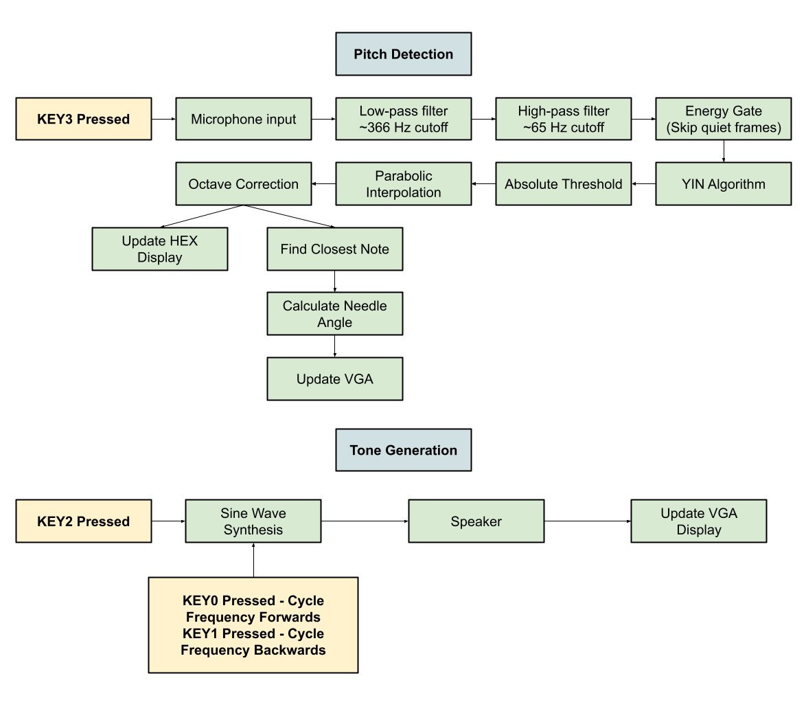

# Guitar Tuner

An embedded C guitar tuner built for the DE1-SoC audio and VGA system. The project includes two modes: pitch detection and tone generation.

In pitch detection mode, the program samples microphone input, estimates the played frequency, identifies the closest note in standard guitar tuning, and displays whether the note is sharp or flat using a VGA dial. In tone generation mode, the program outputs reference notes through the speakers so the user can tune a guitar by ear. 

## System Overview

The pitch detection mode processes microphone input through filtering, energy gating, YIN-based frequency estimation, interpolation, and octave correction before updating the VGA tuning dial and HEX frequency display. Tone generation mode synthesizes reference sine waves for each guitar string and outputs them through the speaker.

## Demo Videos

- [Pitch detection demo](https://youtu.be/VT9vtJ1I34s)
- [Tone generator demo](https://youtu.be/ZuzOS8N_ytI)

## Operation

1. Program starts in pitch detection mode
2. Press KEY2 to enter tone generation mode
3. Press KEY0 and KEY1 to cycle through reference notes
4. Press KEY3 to return to pitch detection mode

## Target Platform

- DE1-SoC board configured with a RISC-V processor
- Embedded C program using memory mapped I/O
- VGA pixel buffer
- HEX displays
- Pushbutton interrupts

*Note: Image assets are embedded directly into the C source file as arrays because the original lab environment used single-file compilation.*

## Acknowledgements

Thank you to James Wang for working on this project with me